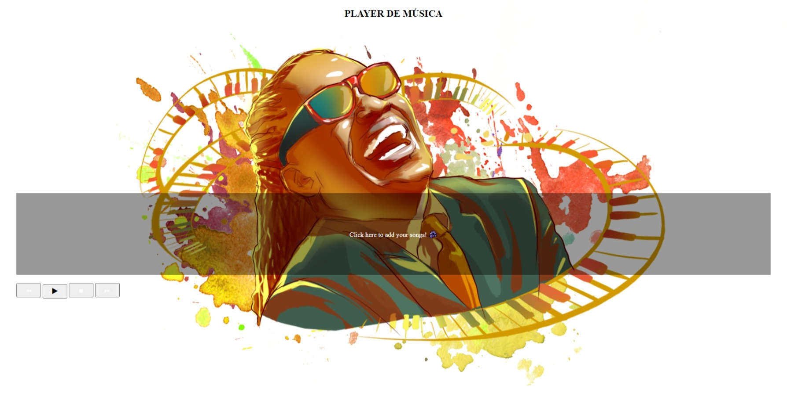

<h1 align="center">🎶 Player de Música</h1>

  

### Importante ⚠️

- Use a pasta: <strong>just-some-nice-songs</strong>, para testar o player 😀

### Site 💻

- [Player de Música](https://player-musica-projeto.netlify.app/)

## Linguagens: 🚀
- HTML
- CSS
- JavaScript
